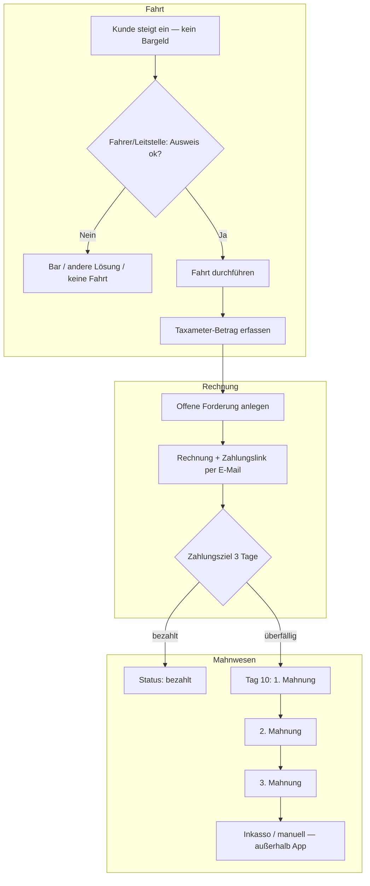

# Plan: Fahrt auf Rechnung mit Ausweisprüfung & Mahnwesen

**Ziel:** Fahrgäste ohne Bargeld können die Fahrt abschließen, wenn der Fahrer die Identität am Personalausweis geprüft hat. Der Betrag wird mit **Zahlungsziel** fällig; bei Nichtzahlung laufen **automatische Erinnerungen und Mahnungen** (konfigurierbare Fristen).

**Stand:** Konzept / Umsetzungsplan — keine Rechtsberatung. Vor Live-Gang: AGB, Datenschutz und Betriebsregeln mit Anwalt/Steuerberater klären.

> **Kostenträger Krankenkasse (Krankenfahrten):** Nicht in diesem Dokument — siehe **[`KRANKENFAHRTEN-KOSTENTRAEGER.md`](KRANKENFAHRTEN-KOSTENTRAEGER.md)**. Dort: Muster 4, IK, Abrechnung bei der Krankenkasse. **Jobcenter** ist bewusst nicht vorgesehen.

---

## 1. Geschäftsmodell in einem Satz

Die **Kunden-App** bucht die Fahrt. Der **Fahrer** (oder die **Leitstelle**) erfasst am Fahrtende den Taxameter-Betrag und bestätigt „Ausweis geprüft“. Das **Backend** erzeugt eine **offene Forderung**, schickt Rechnung/Zahlungslink, überwacht Fristen und verschickt Mahnungen.

---

## 2. Abgrenzung zu bestehenden Features

| Bereich | Heute (`TaxiApp`) | Neu (dieses Modul) |
|--------|-------------------|---------------------|
| Buchung | `POST /api/bookings` → `bookings.json` | Unverändert; optional `paymentMethod: "Rechnung"` |
| Kartenzahlung | Stripe Payment Intent (Kunde, eigenes Handy) | Separater **Zahlungslink** auf offene Rechnung |
| Rechnungen Plattform | `docs/RECHNUNGEN-ABRECHNUNG.md` (Abo 49/99 €) | **Fahrgast-Rechnungen** pro Taxi-Betrieb |
| Leitstelle | `web/dispatch.html` | Tab „Offene Posten“ + Mahnstatus |

---

## 3. Rollen & Ablauf



### 3.1 Fahrer (Phase 2 — Fahrer-UI oder Leitstellen-Eingabe)

1. Fahrt zu Buchung `bookingId` zuordnen (QR, Fahrtnummer oder manuell).
2. Taxameter-Betrag eingeben (Pflicht).
3. Häkchen: **„Personalausweis geprüft“** (Pflicht für Rechnungsmodus).
4. Daten vom Ausweis **abtippen** (kein Foto empfohlen — siehe Datenschutz):
   - Vor- und Nachname
   - Straße, PLZ, Ort (Meldeadresse)
   - Geburtsdatum (optional, je nach Betriebsregel)
5. E-Mail des Kunden (für Rechnung) — Pflicht wenn Mahnwesen per Mail.
6. Einwilligung: Checkbox „Kunde stimmt Zahlung innerhalb von X Tagen zu“ (Text aus AGB).
7. Absenden → Backend legt `invoice` an, Status `open`.

### 3.2 Kunde

- Erhält E-Mail: Rechnungs-PDF (oder HTML), Betrag, Fälligkeit, Button **„Jetzt bezahlen“**.
- Zahlung: Stripe-Link (Karte / Apple Pay) oder Hinweis auf Überweisung (Phase 2).
- Optional später: Deep-Link in iOS-App „Offene Rechnungen“.

### 3.3 Leitstelle (`dispatch.html`)

- Liste **offener Posten** mit Filter: offen / überfällig / gemahnt / bezahlt.
- Aktionen: Mahnung manuell auslösen, Notiz, „bezahlt bar nachträglich“, Export CSV.
- Keine Speicherung von Ausweis-Fotos in der UI.

---

## 4. Fristen & Mahnlogik (Standard — konfigurierbar)

Vorgabe laut Betreiberwunsch; in `tenant-config.json` einstellbar:

| Ereignis | Standard | Konfigurations-Schlüssel |
|----------|----------|-------------------------|
| Zahlungsziel | **3 Tage** nach Fahrtende | `invoicePaymentDays` |
| 1. Mahnung | **10 Tage** nach Fälligkeit | `dunningReminder1DaysAfterDue` |
| 2. Mahnung | **+14 Tage** nach 1. Mahnung | `dunningReminder2DaysAfterFirst` |
| 3. Mahnung | **+14 Tage** nach 2. Mahnung | `dunningReminder3DaysAfterSecond` |
| Mahngebühr 1./2./3. | z. B. 0 € / 2,50 € / 5,00 € | `dunningFee1`, `dunningFee2`, `dunningFee3` |

**Statusmaschine:**

```
draft → open → overdue → reminder_1 → reminder_2 → reminder_3 → paid | written_off | inkasso
```

- `open`: innerhalb Zahlungsziel.
- `overdue`: Fälligkeit überschritten, noch keine Mahnung.
- `reminder_1` … `reminder_3`: Mahnstufen.
- `paid`: vollständig beglichen (Stripe-Webhook oder manuell).
- `written_off`: Betrieb verzichtet (Admin).
- `inkasso`: exportiert, keine weiteren Auto-Mails in der App.

**Hinweis Verbraucherrecht:** Mahngebühren nur in **AGB** und in **angemessener Höhe** (kein Anwalt — vor Live-Gang prüfen).

---

## 5. Datenschutz & Ausweis

| Erlaubt / empfohlen | Nicht empfohlen |
|---------------------|-----------------|
| Name, Adresse, geprüft am …, Fahrer-ID | Foto/Scan des Personalausweises |
| Zweck: Forderung + Mahnwesen | Ausweisnummer dauerhaft (nur wenn rechtlich nötig) |
| Löschfrist nach Bezahlung + Aufbewahrungsfrist | Weitergabe ohne Rechtsgrundlage |

- Einwilligungstext in App/Leitstelle + Verweis auf Datenschutzerklärung (`web/datenschutz.html` ergänzen).
- Aufbewahrung: z. B. 3 Jahre steuerlich / danach anonymisieren (Betrieb klärt mit Steuerberater).

---

## 6. Datenmodell (Backend)

Neue Datei: `data/invoices.json` (Array).

```json
{
  "invoiceId": "uuid",
  "bookingId": "uuid-or-null",
  "tenantId": "default",
  "createdAt": "ISO-8601",
  "tripCompletedAt": "ISO-8601",
  "dueDate": "ISO-8601",
  "status": "open",
  "amountCents": 2450,
  "tipCents": 0,
  "currency": "eur",
  "dunningLevel": 0,
  "dunningFeesCents": 0,
  "totalDueCents": 2450,
  "passenger": {
    "firstName": "Max",
    "lastName": "Mustermann",
    "street": "Musterstr. 1",
    "postalCode": "68159",
    "city": "Mannheim",
    "email": "max@example.com",
    "dateOfBirth": "1990-01-01"
  },
  "identityCheck": {
    "documentType": "personalausweis",
    "checkedAt": "ISO-8601",
    "checkedByDriverId": "driver-1",
    "customerConsentAt": "ISO-8601"
  },
  "payment": {
    "stripePaymentIntentId": null,
    "paidAt": null,
    "method": null
  },
  "dunningHistory": [
    { "level": 1, "sentAt": "ISO-8601", "channel": "email", "feeCents": 250 }
  ],
  "notes": ""
}
```

Erweiterung `bookings.json`:

```json
{
  "paymentMethod": "Rechnung",
  "invoiceId": "uuid",
  "tripStatus": "completed"
}
```

Erweiterung `tenant-config.json`:

```json
{
  "invoicePaymentDays": 3,
  "dunningReminder1DaysAfterDue": 10,
  "dunningReminder2DaysAfterFirst": 14,
  "dunningReminder3DaysAfterSecond": 14,
  "dunningFee1Cents": 0,
  "dunningFee2Cents": 250,
  "dunningFee3Cents": 500,
  "invoiceEnabled": true,
  "invoiceRequireIdentityCheck": true
}
```

---

## 7. API (Backend `server.js`)

### 7.1 Fahrer / Leitstelle (PIN-geschützt wie bestehende Admin-Routen)

| Methode | Pfad | Beschreibung |
|---------|------|--------------|
| `POST` | `/api/invoices` | Forderung anlegen (nach Fahrt) |
| `GET` | `/api/invoices` | Liste (Filter: status, overdue) |
| `GET` | `/api/invoices/:id` | Detail |
| `PATCH` | `/api/invoices/:id/mark-paid` | Manuell bezahlt (Bar nachträglich) |
| `POST` | `/api/invoices/:id/send-reminder` | Mahnung manuell |
| `GET` | `/api/invoices/:id/pdf` | Rechnung PDF (Phase 2) |

### 7.2 Kunde (öffentlich mit Token)

| Methode | Pfad | Beschreibung |
|---------|------|--------------|
| `GET` | `/pay/:invoiceToken` | Zahlungsseite (Web) |
| `POST` | `/api/invoices/:id/create-payment-intent` | Stripe für offenen Betrag |

`invoiceToken`: signierter, nicht erratbarer Hash (kein Login nötig).

### 7.3 Automatisierung

| Job | Intervall | Aktion |
|-----|-----------|--------|
| `checkOverdue` | täglich 08:00 | `open` → `overdue` wenn `dueDate` < heute |
| `sendDunning` | täglich 08:15 | Mahnstufen 1–3 per E-Mail (Resend, bereits im Backend vorbereitet) |

Auf Render: Cron-Job extern (z. B. cron-job.org) ruft `POST /api/cron/dunning` mit Secret auf.

### 7.4 E-Mail (Resend)

Vorlagen:

1. **Rechnung** — Betrag, Fälligkeit, Link `pay/…`
2. **Zahlungserinnerung** — freundlich vor 1. Mahnung (optional Tag 2)
3. **1./2./3. Mahnung** — Betrag inkl. Mahngebühr, neue Frist, Link

---

## 8. Frontend / App — Phasen

### Phase 1 — MVP (4–6 Entwicklungstage)

**Backend**

- [ ] `invoices.json` + CRUD
- [ ] `POST /api/invoices` mit Validierung (Betrag > 0, Identität, E-Mail)
- [ ] Zahlungsziel + Statusmaschine
- [ ] Stripe Payment Intent für `totalDueCents`
- [ ] E-Mail: Rechnung + 1. Mahnung (manuell auslösbar)

**Leitstelle**

- [ ] `dispatch.html`: Formular „Fahrt abschließen auf Rechnung“
- [ ] Tabelle offene Posten

**Kunde**

- [ ] `web/pay.html` — einfache Seite: Betrag + Stripe Button

**Recht / Texte**

- [ ] AGB-Abschnitt „Fahrt auf Rechnung“
- [ ] Datenschutz: Verarbeitung Passagierdaten für Forderungen

### Phase 2 — Automatisches Mahnwesen (3–4 Tage)

- [ ] Cron `dunning` mit allen 3 Stufen
- [ ] Mahngebühren in `totalDueCents` addieren
- [ ] PDF-Rechnung (z. B. `pdfkit` oder HTML → PDF)
- [ ] Export CSV für Buchhaltung / Inkasso

### Phase 3 — iOS Kunden-App (2–3 Tage)

- [ ] Zahlungsart **„Rechnung (nach Fahrt)“** in `PaymentView` — nur Hinweis + AGB
- [ ] Optional: Push/E-Mail-Link „Rechnung offen“ (kein Ausweis in Kunden-App)

### Phase 4 — Fahrer-App / Tablet (größer, optional)

- [ ] Eigene minimale Fahrer-View oder PWA
- [ ] Buchung scannen, Betrag, Ausweis-Formular offline-fähig

---

## 9. iOS Kunden-App — bewusst begrenzt

Die **Ausweisprüfung gehört nicht in die Kunden-App** (Fahrer hält Ausweis physisch).

In `PaymentView` reicht:

- Zahlungswunsch **„Rechnung — Zahlung nach Fahrt mit Ausweis beim Fahrer“**
- Link zu AGB
- Kein Speichern von Ausweisdaten auf dem Kunden-Handy

---

## 10. Risiko & Betriebsregeln (empfohlen)

| Regel | Zweck |
|-------|--------|
| Max. 1 offene Rechnung pro Passagier (Name+Geburtstag) | Missbrauch begrenzen |
| Nur mit Fahrer-Freigabe / Leitstellen-PIN | Kein Selbstservice „ohne Geld fahren“ |
| Obergrenze Betrag (z. B. 80 €) | Risiko deckeln |
| Nachts / Events: optional deaktiviert | `tenant-config.invoiceEnabled` |
| Stammkunden / Firmen später: Whitelist | Weniger Ausweis-Friction |

---

## 11. Kosten & Infrastruktur

| Komponente | Vorhanden? |
|------------|------------|
| Backend Render | Ja (`taxiapp-api.onrender.com`) |
| Stripe | Ja (Test + Live Keys) |
| Resend E-Mail | Ja (`RESEND_API_KEY`) |
| Cron extern | Noch einrichten |
| PDF-Bibliothek | Neu (`pdfkit` o. ä.) |

---

## 12. Erfolgskriterien (Definition of Done)

1. Fahrer/Leitstelle kann Fahrt mit Ausweis-Häkchen und Betrag abschließen.
2. Kunde erhält innerhalb 5 Minuten E-Mail mit Zahlungslink.
3. Nach 3 Tagen ohne Zahlung: Status `overdue`.
4. Nach 10 Tagen überfällig: 1. Mahnung automatisch.
5. Zahlung über Stripe setzt Status auf `paid` und stoppt Mahnlauf.
6. Leitstelle sieht alle Status in `dispatch.html`.

---

## 13. Nächster konkreter Schritt

**Empfohlen:** Mit **Phase 1 MVP** starten — nur Leitstellen-Formular + Backend + `pay.html`, ohne iOS-Fahrer-App.

Priorität beim Start:

1. `tenant-config` Fristen + AGB-Text
2. `POST /api/invoices` + `invoices.json`
3. Formular in `dispatch.html`
4. `web/pay.html` + Stripe
5. Erste Mahnung manuell testen

---

## 14. Offene Entscheidungen (mit Betreiber klären)

- [ ] Maximalbetrag pro Rechnungsfahrt?
- [ ] Überweisung zusätzlich zu Stripe?
- [ ] Ausweis-Foto **nie** oder in Ausnahmefällen mit separater Einwilligung?
- [ ] Inkasso-Partner oder nur CSV-Export?
- [ ] Nur Leitstelle darf freigeben, oder jeder Fahrer?

---

*Dokument: Planungsgrundlage für TaxiApp — Fahrt auf Rechnung & Mahnwesen.*
