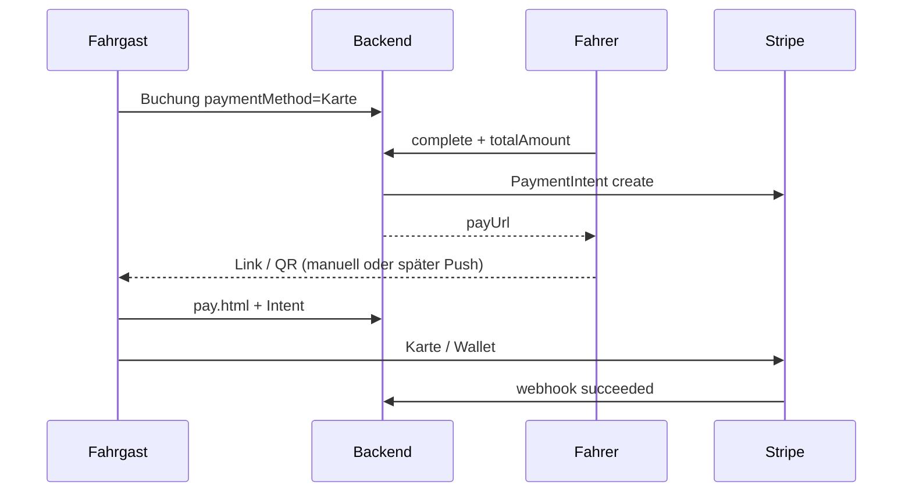

# Kartenzahlung Fahrgast (Online)

**Status:** MVP implementiert (Code) — Live braucht Stripe-Keys auf Render.

## Ablauf

1. Fahrgast bucht mit **Zahlung: Karte** (Web `book.html` oder iOS `PaymentView`).
2. Fahrpreis bleibt **0** — laut Taxameter.
3. Fahrer schließt die Fahrt ab und trägt den **Taxameter-Betrag** ein  
   (`driver-track.html`, Fahrer-App oder API).
4. Backend erzeugt einen **Stripe PaymentIntent** und einen Zahlungslink:
   `https://…/pay.html?b={bookingId}&t={token}`
5. Fahrgast zahlt per Karte / Apple Pay / Google Pay auf der Zahlungsseite.
6. Stripe-Webhook `payment_intent.succeeded` setzt `paymentStatus: paid`.

## API

| Methode | Pfad | Zweck |
|---------|------|--------|
| `GET` | `/api/stripe/config` | `{ paymentsEnabled, publishableKey }` |
| `GET` | `/api/pay/:bookingId?token=` | Öffentliche Zahlungsinfos |
| `POST` | `/api/pay/:bookingId/intent` | Body: `{ token }` → `{ clientSecret }` |
| `POST` | `/create-payment-intent` | Legacy + optional `bookingId` |
| `PATCH` | `/api/driver/bookings/:id/complete` | Body: `{ driverUid, totalAmount }` (EUR) |

## Env (Render)

| Variable | Pflicht |
|----------|---------|
| `STRIPE_SECRET_KEY` | ja (`sk_test_…` / `sk_live_…`) |
| `STRIPE_PUBLISHABLE_KEY` | ja für `pay.html` (`pk_test_…` / `pk_live_…`) |
| `STRIPE_WEBHOOK_SECRET` | ja — Event `payment_intent.succeeded` mit abonnieren |
| `PUBLIC_BASE_URL` | empfohlen (`https://luckystaxiapp.de`) |

Webhook-URL: `https://luckystaxiapp.de/api/billing/webhook` (gleicher Endpunkt wie Abo).

## Buchungsfelder

- `paymentMethod`: `"Karte"` oder `"Bar"`
- `passengerEmail`: optional (Stripe-Quittung)
- `totalAmount`: EUR nach Fahrtende
- `paymentStatus`: `null` \| `pending` \| `paid` \| `failed`
- `paymentIntentId`, `paymentAccessToken`, `paidAt`

## Test (Stripe Testmodus)

Karte: `4242 4242 4242 4242`, beliebiges Datum, CVC `123`.

## Noch nicht

- Automatischer Link per SMS/E-Mail/Push
- Stripe Connect (Geld direkt an Mandanten)
- Vorautorisierung bei Buchung
- Tap to Pay am Fahrer-Handy → siehe `docs/TAP-TO-PAY.md`
