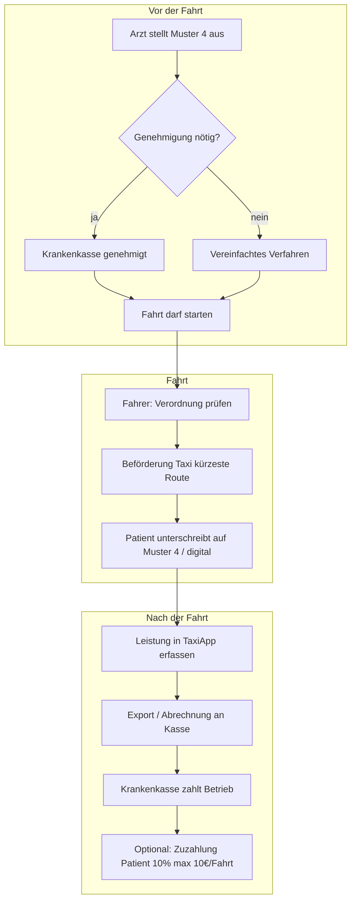

# Plan: Krankenfahrten — Kostenträger Krankenkasse

**Ziel:** Taxi-Betriebe können **medizinisch verordnete Krankenfahrten** erfassen, dokumentieren und **bei der Krankenkasse abrechnen** — statt Jobcenter-Gutscheinen oder „Ausweis auf Rechnung“.

**Stand:** Konzept / Umsetzungsplan — keine Rechts- oder Abrechnungsberatung. Abrechnungspflichten und Rahmenverträge sind **bundesland- und verbandsspezifisch** (z. B. vdek, Taxiverband Hessen).

**Abgrenzung:** [`FAHRT-AUF-RECHNUNG-MAHNWESEN.md`](FAHRT-AUF-RECHNUNG-MAHNWESEN.md) bleibt für **private Rechnung + Mahnung** (kein Geld, Personalausweis). **Dieses Dokument** ist für **§ 60 SGB V Krankenbeförderung** mit **Krankenkasse als Kostenträger**.

---

## 1. Kurzantwort: Gibt es das schon?

**Ja — bundesweit etabliert**, aber **nicht als ein Button in einer Taxi-Bestell-App**.

| Was existiert | Wer macht es heute |
|---------------|-------------------|
| Ärztliche **Verordnung Muster 4** | Arzt / Psychotherapeut |
| **Genehmigung** der Krankenkasse (oft vorab) | Krankenkasse |
| **Rahmenvertrag** + **IK** (Institutionskennzeichen) | Taxiunternehmer ↔ Kassenverbände |
| **Abrechnung** (Papier, DTA, Abrechnungszentrum) | Betrieb, DMRZ, azh, … |
| Fahrtnachweis (Datum, Unterschrift Patient) | Fahrer auf Verordnung |

Die TaxiApp kann **Fahrtdaten + Verordnungsdaten digital erfassen** und für die Abrechnung **exportieren** — die **Zahlung kommt von der Krankenkasse an den Betrieb**, nicht vom Patienten (abzüglich gesetzlicher **Zuzahlung**).

**Jobcenter** ist hier **nicht** vorgesehen.

---

## 2. Voraussetzungen beim Taxiunternehmen (vor Software)

Ohne diese Punkte **lehnt die Kasse die Abrechnung ab**:

| # | Voraussetzung | Kurzbeschreibung |
|---|---------------|------------------|
| 1 | **Institutionskennzeichen (IK)** | 9-stellig, Antrag bei [ARGE IK / SVI](https://www.krankenfahrten.de/) — pro Betriebsstätte |
| 2 | **Rahmenvertrag** | Regional mit Kassenverbänden (z. B. [vdek BW](https://www.vdek.com/LVen/BAW/Service/Taxi/taxi-und-mietwagen.html), [Taxiverband Hessen](https://taxiverband-hessen.de/?page_id=93)) |
| 3 | **Verpflichtungsschein** + Fahrzeug-Genehmigungsurkunden | An Verband / Kassenverbund senden |
| 4 | **Tarifkennzeichen / Positionsnummern** | Aus Vergütungsliste (z. B. AC/TK `46 06 799` — **regionabhängig**) |
| 5 | **Muster 4** je Fahrt | Vom Arzt; Patient unterschreibt pro Fahrt |

**Hinweis:** Normale **App-Buchungen** (Wohnung → Bahnhof) sind **keine** Krankenfahrten, wenn kein Muster 4 vorliegt.

---

## 3. Ablauf in der Praxis



### 3.1 Was der Patient mitbringt

- **Elektronische Gesundheitskarte** (Versichertennummer)
- **Verordnung Muster 4** (Original)
- Ggf. **Genehmigungsbescheid** der Krankenkasse

### 3.2 Was der Fahrer prüft

- Stimmt **Name / Versichertennummer**?
- Ist **Taxi** als Beförderungsmittel angekreuzt?
- Ist die Fahrt **medizinisch begründet** (Arzt-Eintrag)?
- **Hin- und/oder Rückfahrt** erlaubt?
- Bei Serienfahrten: **Genehmigung** für Zeitraum?

### 3.3 Wer bekommt das Geld?

| Zahlung | Empfänger |
|---------|-----------|
| Fahrpreis (abzüglich Zuzahlung) | **Taxiunternehmen** von **Krankenkasse** |
| Zuzahlung (wenn fällig) | **Bar/Karte an Fahrer** — gesetzlich geregelt |

---

## 4. Was die TaxiApp leisten kann (realistisch)

### Stufe A — Dokumentation & Export (MVP, machbar)

**Kein** direkter Kassen-API-Anschluss nötig — viele Betriebe rechnen erst mal **manuell oder über Abrechnungszentrum** ab.

| Feature | Nutzen |
|---------|--------|
| Fahrttyp **„Krankenfahrt“** in Leitstelle / Fahrer-UI | Von normaler Bestellung trennen |
| Erfassung **Muster-4-Daten** | Patient, Kasse, Arzt, Von/Nach, Datum |
| **IK** + Tarifkennzeichen in `tenant-config` | Auf jeder Abrechnung |
| Kilometer / Taxameter / Wartezeit | Abrechnungsgrundlage |
| **Digitale Fahrtbestätigung** (Unterschrift auf Tablet) | Ersetzt handschriftliche Zeile — **Papier-Muster 4** ggf. trotzdem Pflicht |
| Export **CSV / JSON / PDF-Sammelliste** | An Buchhaltung, DMRZ, Steuerberater |
| Status: `erfasst` → `eingereicht` → `bezahlt` → `abgelehnt` | Leitstellen-Übersicht |

### Stufe B — Abrechnungs-Vorbereitung (mittelfristig)

| Feature | Nutzen |
|---------|--------|
| Validierung Pflichtfelder vor Abschluss | Weniger Kassen-Ablehnungen |
| Foto **Muster 4** (verschlüsselt, Löschfrist) | Archiv — DSGVO beachten |
| Mehrfachfahrten / Serien aus einem Bescheid | Weniger Tipparbeit |
| Anbindung **Abrechnungszentrum** (DMRZ, azh, …) | Wenn Partner API anbietet |

### Stufe C — Vollintegration (langfristig, aufwendig)

- **DTA / EDIFACT**-Abrechnung § 302 SGB V
- Echtzeit-**Genehmigungsprüfung** bei Kasse
- eGK einlesen (spezielle Hardware / Zertifizierung)

→ Für die meisten Taxi-Betriebe reicht **Stufe A + externer Abrechnungsdienstleister**.

---

## 5. Datenmodell (Backend)

Neue Datei: `data/medical-transports.json`

```json
{
  "transportId": "uuid",
  "createdAt": "ISO-8601",
  "completedAt": "ISO-8601",
  "status": "recorded",
  "billingStatus": "pending_submission",
  "tenantIk": "123456789",
  "tariffCode": "4606799",
  "driverId": "driver-1",
  "vehiclePlate": "MA-XY 123",
  "patient": {
    "firstName": "Erika",
    "lastName": "Muster",
    "dateOfBirth": "1955-03-12",
    "insuranceNumber": "A123456789",
    "insuranceFundName": "AOK BW",
    "insuranceFundIk": "108018007",
    "address": "Hauptstr. 1, 68159 Mannheim"
  },
  "prescription": {
    "formType": "muster_4",
    "prescribingDoctorName": "Dr. med. …",
    "prescribingDoctorNumber": "LANR-or-BSNR",
    "issuedOn": "2026-06-10",
    "approvalNumber": "KK-Genehmigung-optional",
    "approvalValidUntil": "2026-12-31",
    "tripPurpose": "ambulante Behandlung",
    "transportMode": "taxi",
    "roundTrip": "outbound",
    "seriesApproved": false
  },
  "route": {
    "fromAddress": "Hauptstr. 1, Mannheim",
    "toAddress": "Klinikum Mannheim",
    "distanceKm": 8.4,
    "isShortestRoute": true
  },
  "fare": {
    "meterAmountCents": 2850,
    "waitingMinutes": 0,
    "positionCodes": ["xxxxxx"],
    "copaymentCents": 1000,
    "copaymentCollected": true,
    "copaymentMethod": "cash"
  },
  "signatures": {
    "patientSignedAt": "ISO-8601",
    "driverSignedAt": "ISO-8601"
  },
  "documents": {
    "prescriptionScanUrl": null,
    "notes": ""
  },
  "billing": {
    "submittedAt": null,
    "paidAt": null,
    "rejectedAt": null,
    "rejectionReason": null,
    "externalBillingRef": null
  }
}
```

Erweiterung `tenant-config.json`:

```json
{
  "medicalTransportEnabled": true,
  "providerIk": "123456789",
  "tariffCode": "4606799",
  "frameworkContractRegion": "BW",
  "copaymentEnabled": true,
  "requirePrescriptionPhoto": false,
  "defaultInsuranceFunds": [
    { "name": "AOK BW", "ik": "108018007" }
  ]
}
```

---

## 6. API (Erweiterung `server.js`)

| Methode | Pfad | Beschreibung |
|---------|------|--------------|
| `POST` | `/api/medical-transports` | Krankenfahrt abschließen |
| `GET` | `/api/medical-transports` | Liste (Filter: billingStatus) |
| `GET` | `/api/medical-transports/:id` | Detail |
| `PATCH` | `/api/medical-transports/:id/billing-status` | eingereicht / bezahlt / abgelehnt |
| `GET` | `/api/medical-transports/export.csv` | Abrechnungs-Export |
| `GET` | `/api/medical-transports/:id/copayment-receipt` | Zuzahlungsquittung PDF |

Admin-PIN wie bei `/api/bookings`.

---

## 7. UI — wo es hingehört

| Ort | Inhalt |
|-----|--------|
| **`web/dispatch.html`** | Neuer Tab **„Krankenfahrten“**: Formular Muster 4 + Abschluss |
| **Fahrer-PWA** (später) | Kurzform + Unterschrift |
| **Kunden-iOS-App** | **Kein** Krankenfahrt-Buchen nötig — Patient ruft Leitstelle / Taxizentrale oder hat Verordnung vom Arzt |
| Optional | Hinweis auf Startseite: *„Krankenfahrten nur mit ärztlicher Verordnung — bitte Zentrale anrufen“* |

**Zahlungsart in `PaymentView`:** Nicht „Krankenkasse-Gutschein“, sondern separater Geschäftszweig **Krankenfahrt** (eigener Flow).

---

## 8. Phasen & Aufwand

### Phase 1 — MVP Dokumentation (5–7 Tage)

- [ ] `medical-transports.json` + `POST/GET` API
- [ ] Leitstelle: Formular mit Pflichtfeldern Muster 4
- [ ] IK + Tarif aus `tenant-config`
- [ ] Zuzahlung erfassen (Betrag + bar ja/nein)
- [ ] CSV-Export für Buchhaltung
- [ ] Checkliste Fahrer (Validierung vor Speichern)

### Phase 2 — Unterschrift & Archiv (3–4 Tage)

- [ ] Unterschrift Patient auf Tablet (Canvas → PNG)
- [ ] Optional Foto Muster 4 (Upload, verschlüsselt)
- [ ] PDF **Fahrtnachweis** pro Fahrt
- [ ] Status-Workflow in Leitstelle

### Phase 3 — Abrechnung (abhängig vom Partner)

- [ ] Schnittstelle Abrechnungszentrum **oder**
- [ ] Import-Vorlage für DMRZ/azh
- [ ] Statistik: offen / eingereicht / bezahlt / abgelehnt

### Phase 4 — iOS (optional, geringe Priorität)

- [ ] Nur Info-Screen „Krankenfahrten“ + Telefon Leitstelle

---

## 9. Validierungsregeln (Software)

Vor Abschluss warnen/blockieren wenn:

| Regel | Grund |
|-------|--------|
| Kein `providerIk` in Config | Abrechnung unmöglich |
| Keine Versichertennummer | Pflicht auf Muster 4 |
| Kein Ziel / Start | Fahrtweg |
| `meterAmountCents` ≤ 0 | Betrag fehlt |
| Serienfahrt ohne `approvalValidUntil` | Genehmigung fehlt |
| Keine Patienten-Unterschrift (Phase 2) | Kasse fordert Nachweis |

---

## 10. Unterschied zu anderen Modulen

| Modul | Kostenträger | Wann Geld beim Betrieb |
|-------|--------------|------------------------|
| **Krankenfahrt** (dieses Dokument) | **Krankenkasse** | Nach Abrechnung (Wochen) |
| Fahrt auf Rechnung | **Patient** | Nach Zahlungsziel / Mahnung |
| Normale App-Buchung | Patient bar/Karte | Sofort |
| Jobcenter | ❌ nicht geplant | — |

---

## 11. Checkliste Betrieb vor Go-Live

- [ ] IK beantragt und in Rahmenvertrag eingetragen
- [ ] Rahmenvertrag regional abgeschlossen
- [ ] Muster-4-Formulare im Fahrzeug
- [ ] Schulung Fahrer: Verordnung prüfen, Zuzahlung kassieren
- [ ] Entscheidung: Abrechnung **selbst** oder **Abrechnungszentrum**
- [ ] Datenschutz: Patientendaten, ggf. Foto Verordnung
- [ ] AGB/Impressum: Hinweis Krankenfahrten

---

## 12. Nächster Schritt (empfohlen)

1. **Betrieb klärt:** Bundesland, Verband, IK vorhanden?
2. **Phase 1 MVP** in `dispatch.html` + Backend
3. Test mit **einer** Beispiel-Verordnung (ohne echte Patientendaten)
4. Export an Steuerberater / Abrechnungszentrum prüfen lassen

---

## 13. Quellen & weiterführend

- [vdek — Taxi und Mietwagen (BW)](https://www.vdek.com/LVen/BAW/Service/Taxi/taxi-und-mietwagen.html)
- [Taxiverband Hessen — IK Krankenfahrten](https://taxiverband-hessen.de/?page_id=93)
- [DMRZ — Ratgeber Krankenfahrten](https://www.dmrz.de/wissen/ratgeber/krankenfahrten-und-krankentransporte-die-wichtigsten-news-und-infos)
- [Bundesagentur Vermittlungsbudget](https://www.arbeitsagentur.de/arbeitslos-arbeit-finden/buergergeld/arbeit-finden/foerderung-aus-dem-vermittlungsbudget-jobcenter) — **nicht** für dieses Modul

---

*Dokument: Planungsgrundlage TaxiApp — Krankenfahrten mit Kostenträger Krankenkasse.*
