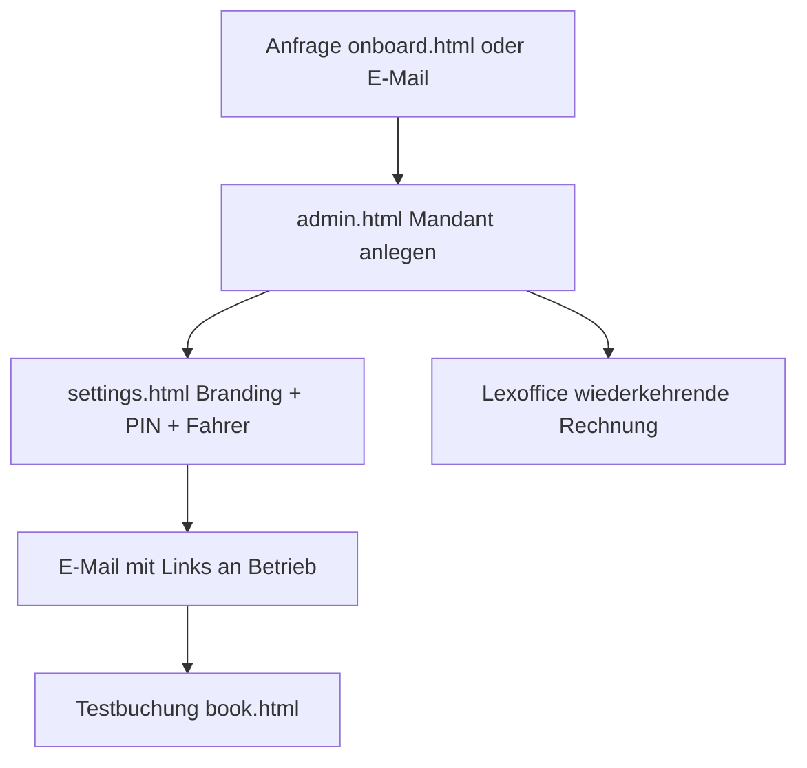

# Vermietung — Taxi-Betriebe manuell onboarden

Anleitung für dich als **Plattformbetreiber**: Taxi-Unternehmen mieten die Software (49 € / 99 € monatlich per Lexoffice), du richtest den Mandanten ein und übergibst Leitstelle, QR und App mit **Runtime-Branding**.

Live-Backend: **https://taxiapp-api.onrender.com**

---

## Ablauf (Übersicht)



---

## Schritt 1 — Voraussetzungen (einmalig)

- [ ] Render Dashboard → Service `taxiapp-api` → **ADMIN_PIN** setzen → Redeploy
- [ ] Render **Starter-Plan + Persistent Disk** (in [`render.yaml`](../render.yaml) vorkonfiguriert)
- [ ] Gewerbe + Lexoffice/sevDesk — siehe [`RECHNUNGEN-ABRECHNUNG.md`](RECHNUNGEN-ABRECHNUNG.md)
- [ ] Readiness prüfen:

```bash
export ADMIN_PIN=deine-pin
bash ~/Projects/TaxiApp/scripts/rental-readiness-check.sh
```

---

## Schritt 2 — Anfrage vom Betrieb

Öffentliches Formular: [onboard.html](https://taxiapp-api.onrender.com/onboard.html)

- Erzeugt nur einen **Lead** (`status: pending`)
- Du erhältst optional E-Mail (wenn `RESEND_API_KEY` gesetzt)

Alternativ: Tarif-Anfrage über [index.html#operators](https://taxiapp-api.onrender.com/index.html#operators)

---

## Schritt 3 — Mandant anlegen (du)

**Web:** [admin.html](https://taxiapp-api.onrender.com/admin.html) (ADMIN_PIN)

**CLI:**

```bash
export ADMIN_PIN=deine-pin
export COMPANY_NAME="Mustermann Taxi GmbH"
export EMAIL=kontakt@muster.de
export CENTRAL_PHONE=+49621123456
export CITY=Mannheim
export POSTAL_PREFIXES=68
export PLAN_ID=starter
export DISPATCH_PIN=123456
bash ~/Projects/TaxiApp/scripts/create-tenant.sh
```

Felder:

| Feld | Bedeutung |
|------|-----------|
| `planId` | `starter` (max. 5 Fahrer) oder `business` (unbegrenzt) |
| `dispatchPin` | Schützt Leitstelle des Betriebs |
| `postalPrefixes` | PLZ-Routing für App/Browser |

Pending-Leads aus onboard.html: in admin.html **Aktivieren**.

---

## Schritt 4 — Betrieb konfigurieren

Öffne `settings.html?o=SLUG` (Link aus admin.html):

1. Firmenname, Zentrale, Impressum
2. **Leitstellen-PIN** (falls noch nicht gesetzt)
3. **Erscheinungsbild:** Logo-URL, Primär-/Akzentfarbe
4. Servicegebiet (PLZ)
5. Fahrer anlegen (Starter: max. 5)

---

## Schritt 5 — Rechnung (Lexoffice)

Wiederkehrende Rechnung an `billingEmail`:

- Starter: 49 € netto/Monat
- Business: 99 € netto/Monat

Details: [`RECHNUNGEN-ABRECHNUNG.md`](RECHNUNGEN-ABRECHNUNG.md)

---

## Schritt 6 — Übergabe an den Betrieb

Vorlage: [`PILOT-START.md`](PILOT-START.md) — Platzhalter ersetzen:

| Link | URL |
|------|-----|
| Leitstelle | `https://taxiapp-api.onrender.com/dispatch.html?o=SLUG` |
| Einstellungen | `https://taxiapp-api.onrender.com/settings.html?o=SLUG` |
| Browser-Buchung | `https://taxiapp-api.onrender.com/book.html?o=SLUG` |
| QR | `https://taxiapp-api.onrender.com/qr.html?o=SLUG` |

**PIN** separat senden (nicht in derselben E-Mail wie öffentliche Links).

**App:** FahrgastApp erkennt Betrieb per PLZ/GPS oder Deep Link `fahrgastapp://book?o=SLUG`

---

## Schritt 7 — Test

```bash
bash ~/Projects/TaxiApp/scripts/test-multi-tenant-e2e.sh
bash ~/CollectionApp/FahrgastApp/scripts/go-live-check.sh
```

Manuell: Buchung in `book.html?o=SLUG` → Zeile in `dispatch.html?o=SLUG`

---

## Abnahme „vermietbar“

- [ ] `authRequired: true` auf `/health`
- [ ] Öffentliches Register nur `pending`
- [ ] Mandanten nur über admin.html aktiv
- [ ] Branding sichtbar in App + book.html
- [ ] Daten persistent (Render Disk)
- [ ] Lexoffice-Rechnung läuft

---

## Verwandte Doku

- Multi-Mandant technisch: [`MULTI-TENANT.md`](MULTI-TENANT.md)
- Pilot-E-Mail: [`PILOT-START.md`](PILOT-START.md)
- Fahrgast-App: `~/CollectionApp/FahrgastApp/docs/GO-LIVE.md`
