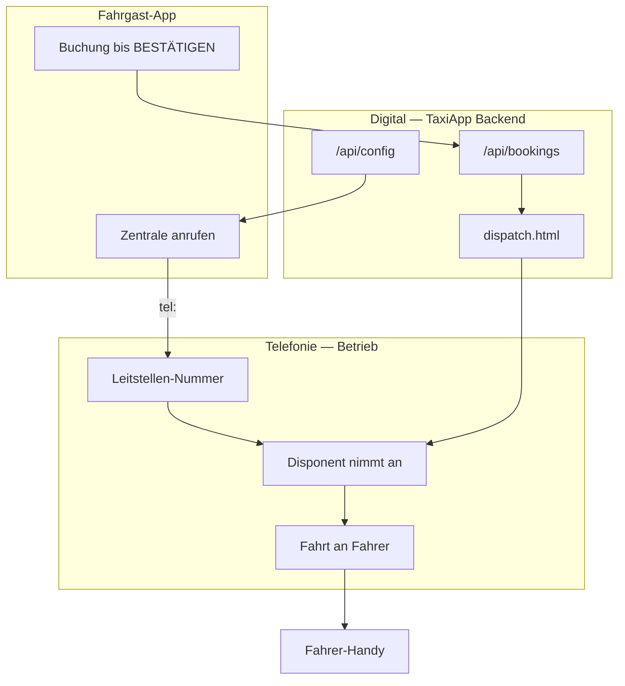

# Leitstelle / Zentrale — Systemüberblick

## Ablauf (Stufe 1–4)



## Stufen

| Stufe | Inhalt | Status |
|-------|--------|--------|
| 1 | Echte Zentrale-Nummer (`tenant-config.json` + App) | ✅ |
| 2 | `dispatch.html` als Leitstellen-Bildschirm | ✅ |
| 3 | Telefon manuell: Disponent + Handy, App-Fahrten in dispatch | ✅ |
| 4 | `/api/config` pro Mandant, App lädt Nummer | ✅ |

## Erweiterungen A / B / C

| Punkt | Inhalt | Status |
|-------|--------|--------|
| A | Nummer editierbar in App + Anzeige unter Button | ✅ |
| B | `GET /api/config` | ✅ |
| C | VoIP-Vorbereitung: `POST /api/calls/incoming` → dispatch | ✅ (Stub) |

## Sprint 1 — Fahrer zuweisen

- `backend/drivers.json` — Fahrer (Name, Telefon, Kennzeichen, Status)
- `GET /api/drivers` — Liste für dispatch.html
- `PATCH /api/bookings/:id/assign` — Fahrer einer Buchung zuweisen
- dispatch.html — Fahrer-Übersicht, Dropdown, Karte, „Fahrer anrufen“

## Konfiguration

Datei: `backend/tenant-config.json`

```json
{
  "companyName": "TaxiApp Leitstelle",
  "centralPhone": "+493012345678",
  "centralPhoneDisplay": "030 12345678"
}
```

App lädt beim Start `/api/config`. Lokale Überschreibung im Fahrer-Profil → „Leitstellen-Nummer“.

## Leitstelle im Browser

1. `cd backend && npm start`
2. Öffnen: http://127.0.0.1:4242/dispatch.html
3. Tablet/PC in der Zentrale dauerhaft offen lassen

**Manueller Telefon-Ablauf (Stufe 3):**

1. Fahrgast ruft Zentrale an (Button in App)
2. Disponent nimmt am Telefon ab, notiert Adresse
3. Disponent vergibt Fahrt an Fahrer (Anruf / Funk)
4. Parallel: App-Buchungen erscheinen in dispatch → „Angenommen“ / „Fahrer unterwegs“

## VoIP später (Stufe C — Twilio o. Ä.)

Webhook an Backend:

```http
POST /api/calls/incoming
Content-Type: application/json

{ "from": "+491701234567", "note": "Anruf Leitstelle" }
```

Eintrag erscheint in dispatch.html unter „Telefon-Anrufe“. Disponent übernimmt wie bei App-Buchung.

Anbieter (Twilio, Sipgate): eingehende Nummer → Webhook URL → dieses Endpoint.
